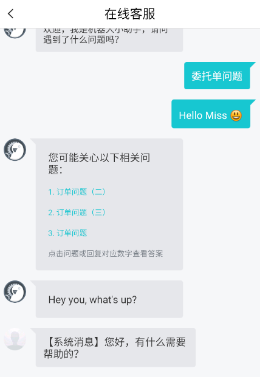
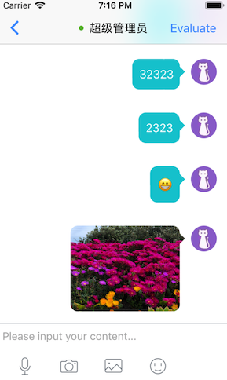

# MeiQia SDK for React Native

[](https://github.com/996icu/996.ICU/blob/master/LICENSE)
[](https://github.com/Kennytian/meiqia-react-native/pulls)
[](https://www.npmjs.com/package/meiqia-react-native)
[](https://www.npmjs.com/package/meiqia-react-native)
[](https://github.com/Kennytian/meiqia-react-native/graphs/contributors)
[](https://github.com/Kennytian/meiqia-react-native/commits/master)


## Getting started

`$ npm install meiqia-react-native --save`

or

`$ yarn add meiqia-react-native`

### Mostly automatic installation

`$ react-native link meiqia-react-native`

#### iOS
1. Select you app target on XCode and click the `Build Settings` tab. Go to the `Framework Search Paths` section and `add` this new entry
   ```
   $(SRCROOT)/../node_modules/meiqia-react-native/ios
   ```
   and make sure it is set to `recursive`
2. Select you app target on XCode and click the `Build Phases` tab. Go to the `Copy Bundle Resources` section and `add` this new entry
   ```
   node_modules/meiqia-react-native/ios/MeiQiaSDK/MQChatViewController/Assets/MQChatViewAsset.bundle
   ``` 
### Manual installation

#### iOS

1. In XCode, in the project navigator, right click `Libraries` ➜ `Add Files to [your project's name]`
2. Go to `node_modules` ➜ `meiqia-react-native` and add `RNMeiqia.xcodeproj`
3. In XCode, in the project navigator, select your project. Add `libRNMeiqia.a` to your project's `Build Phases` ➜ `Link Binary With Libraries`
4. Select you app target on XCode and click the `Build Settings` tab. Go to the `Framework Search Paths` section and add this new entry
   ```
   $(SRCROOT)/../node_modules/meiqia-react-native/ios
   ```
   and make sure it is set to `recursive`
5. Select you app target on XCode and click the `Build Phases` tab. Go to the `Copy Bundle Resources` section and `add` this new entry
   ```
   node_modules/meiqia-react-native/ios/MeiQiaSDK/MQChatViewController/Assets/MQChatViewAsset.bundle
   ``` 
6. Run your project (`Cmd+R`)<

#### Android

1. Open up `android/app/src/main/java/[...]/MainActivity.java`
  - Add `import com.reactlibrary.RNMeiqiaPackage;` to the imports at the top of the file
  - Add `new RNMeiqiaPackage()` to the list returned by the `getPackages()` method
2. Append the following lines to `android/settings.gradle`:
   ```
  	include ':meiqia-react-native'
  	project(':meiqia-react-native').projectDir = new File(rootProject.projectDir, '../node_modules/meiqia-react-native/android')
   ```
3. Insert the following lines inside the dependencies block in `android/app/build.gradle`:
   ```
   compile project(':meiqia-react-native')
   ```

## Usage

#### import
```javascript
import { MeiqiaInit, MeiqiaShow } from 'meiqia-react-native';
```

#### init appKey
```javascript
MeiqiaInit({ appKey:'xxx' }).then((config)=>{
    console.log('config info:', config);
    // {"code:": 0, "clientId": "xxxxx", "message": 'success'}
});
```

#### launch chat window
```javascript
MeiqiaShow({}); 
```
or, if you known

```javascript
MeiqiaShow({
  titleColor: '',
  titleBarColor: '', 
  naviColor: '', 
  clientInfo: {
      name: 'Kenny锅',
      gender: '男',
      age: '20',
      tel: '13800138000',
      weixin: 'wechat007',
      weibo: 'weibo007',
      address: '湖北省武汉市xxx',
      email: 'kenny@china.com',
      avator: 'https://s3.cn-north-1.amazonaws.com.cn/pics.meiqia.bucket/1dee88eabfbd7bd4',
      source: '朋友推荐',
      comment: '全栈，就是了不起，备注也没问题'
  }, 
  customId:{id:''}, 
  clientId:{id:''}, 
  scheduledInfo:{agentId:'', agentGroup:'', scheduleRule: 'none|group|enterprise', },
});
```

> Now, we can see the default chat window

## APIs
### MeiqiaInit

`MeiqiaInit({param1, param2, ...});`

| param name | param type | default value | platform
| :------: | :------ | :------ | :------: |
| appKey | string | required | all

### MeiqiaShow

`MeiqiaShow({param1, param2, ...});`

| param name | param type | default value | platform
| :------: | :------ | :------ | :------: |
| titleColor | string | '#000000' | iOS
| titleBarColor | string | '' | iOS
| naviColor | string | '' | iOS
| clientInfo | Object | {} | all
| customId | Object | {} | all
| clientId | Object | {} | all
| scheduledInfo | Object | {} | all

### MeiqiaStartService

`MeiqiaStartService();`

### MeiqiaStopService
                     
`MeiqiaStopService();`

### MeiqiaRegisterDeviceToken

`MeiqiaRegisterDeviceToken('xxxx-xxx-xxx');`

> NOTICE: This function only for iOS

## Screenshot

### Android




### iOS


## Debugging

#### iOS
>Q: Why debugging on real device, the UI language is English?

In order to properly recognize the App's system language, you need to add a Localizations configuration. If you need to support English, Simplified Chinese, and Traditional Chinese, you need the following configuration in the Source Code of `info.plist`:

```xml
<key>CFBundleLocalizations</key>
<array>
    <string>zh_CN</string>
    <string>zh_TW</string>
    <string>en</string>
</array>
```

or you also can run npm script: `node ./node_modules/meiqia-react-native/ios-configuration.js YOUR_APP_NAME`
